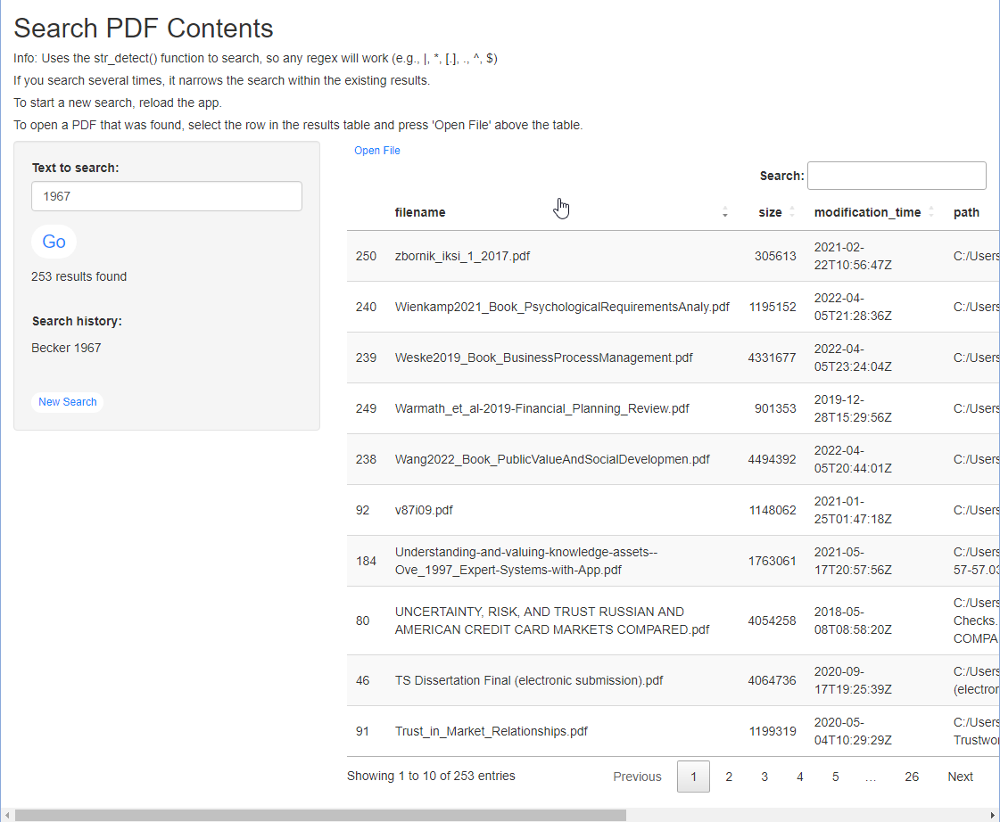

<!-- README.md is generated from README.Rmd. Please edit that file -->

```{r, include = FALSE}
knitr::opts_chunk$set(
  collapse = TRUE,
  comment = "#>"
)
```

# Search PDF Contents

<!-- badges: start -->

<!-- badges: end -->

'Search PDF Contents' is a Shiny app I created for myself and use regularly. It helps you find information by searching the contents of your PDF files that you pre-indexed beforehand. I often use it to pull up papers that use a specific reference or contain certain subject-matter co-occurrence (e.g., 'credit\|loan' & 'trustworth\*'). Hopefully, other people will find this app as helpful as I do.

You use regex for your search queries and narrow the results with subsequent searches. You can search and sort by names and directories within the results, and open files with just a click of a button.

Here's a preview of the app:



While I've used other tools that are capable of performing the same actions (e.g., ['Everything'](https://www.voidtools.com/)), these would often freeze-up when asked to search through a large collection of files. With this Shiny app, I am more confident about finding the files I need, with the only con being that it's not the fastest solution. However, it's much more important for me to find all the necessary results after several minutes, than to feel uncertain about the existence of the file of interest.

## Important user settings

-   In `_targets.R`, change the `max_size` and `my_dir1`, `my_dir2` accordingly (adding more `my_dir` variables as necessary).

    -   This controls which PDF files get indexed based on the maximum allowed size and the paths of directories of interest.

## 1. Set-Up

The app uses the package `targets` to store the database of your PDF file contents. You can see the workflow used in creating this database below:

```{r}
targets::tar_visnetwork()
```

You only need to run `tar_make()` once for the first-time set-up of the database, and then, re-run only once in a while to update it (depending on how often you re-arrange/add new files).

I'm currently working on making the `targets` section more efficient so that it only updates outdated content, but for now, I recommend only 'making' the `"all_pdf_contents2"` target. This can be achieved with the following line of code:

```{r, eval=FALSE}
targets::tar_make("all_pdf_contents2")
```

I recommend running this overnight since it can take a very long time if you have a lot of PDF files to scan. I have about 20,500 files, totalling 16.2Gb in size, and for me, it takes about 2 hours to run. That's about 170 files/minute or 140Mb/minute. To find out how long your database will take before you attempt it, I recommend 'making' just the `"pdf_dir"` target and then estimating the number of minutes with the following:

```{r, eval=FALSE}
targets::tar_make("pdf_dir")
targets::tar_load(pdf_dir)

# estimate based on number of files:
round(length(pdf_dir) / 170)

# estimate based on file size:
sum(fs::file_info(pdf_dir)$size) / "140Mb"
```

## 2. Running the App

Once you've indexed your PDF files' contents once with `targets::tar_make()`, you can open the `app.R` file and just run the app.

I made the app not .Rproj dependent, so feel free to create a desktop shortcut to quickly run it whenever (like I did!).

## Limitations

-   Requires the [poppler-utils package](https://poppler.freedesktop.org/) for reading PDFs (available for all platforms)
-   Only works on PDF files that are on paths shorter than 259 characters (longer paths introduced bugs, so I had to implement this limit)
-   Some PDFs are not machine-readable (e.g., older/bad quality scans) and so will not get indexed
