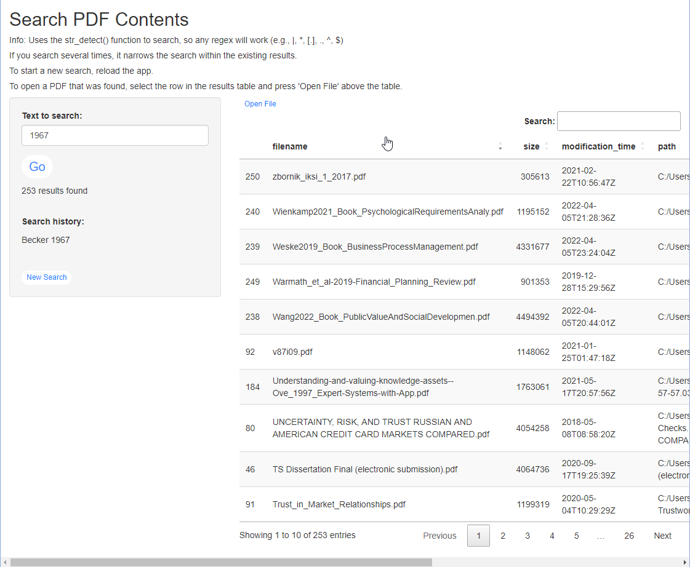
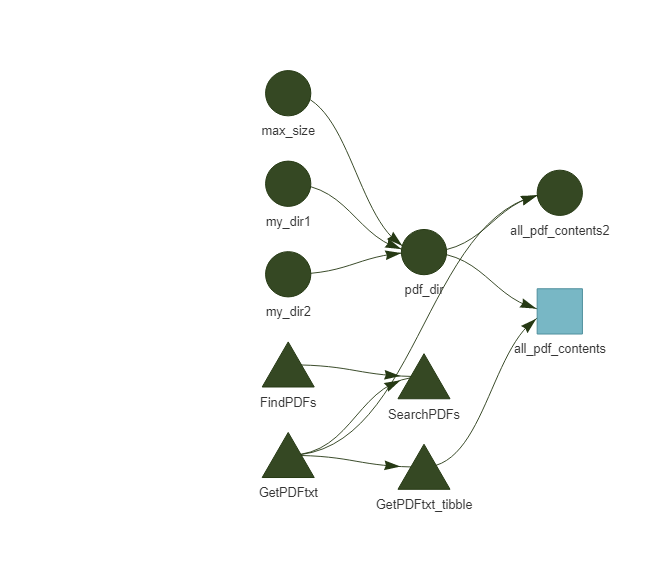

<!-- README.md is generated from README.Rmd. Please edit that file -->

# Search PDF Contents

<!-- badges: start -->
<!-- badges: end -->

‘Search PDF Contents’ is a Shiny app I created for myself and use
regularly. It helps you find information by searching the contents of
your PDF files that you pre-indexed beforehand. I often use it to pull
up papers that use a specific reference or contain certain
subject-matter co-occurrence (e.g., ‘credit\|loan’ & ‘trustworth\*’).
Hopefully, other people will find this app as helpful as I do.

You use regex for your search queries and narrow the results with
subsequent searches. You can search and sort by names and directories
within the results, and open files with just a click of a button.

Here’s a preview of the app:



While I’ve used other tools that are capable of performing the same
actions (e.g., [‘Everything’](https://www.voidtools.com/)), these would
often freeze-up when asked to search through a large collection of
files. With this Shiny app, I am more confident about finding the files
I need, with the only con being that it’s not the fastest solution.
However, it’s much more important for me to find all the necessary
results after several minutes, than to feel uncertain about the
existence of the file of interest.

## Important user settings

-   In `_targets.R`, change the `max_size` and `my_dir1`, `my_dir2`
    accordingly (adding more `my_dir` variables as necessary).

    -   This controls which PDF files get indexed based on the maximum
        allowed size and the paths of directories of interest.

## 1. Set-Up

The app uses the package `targets` to store the database of your PDF
file contents. You can see the workflow used in creating this database
below:

``` r
targets::tar_visnetwork()
```

<!-- -->

You only need to run `tar_make()` once for the first-time set-up of the
database, and then, re-run only once in a while to update it (depending
on how often you re-arrange/add new files).

I’m currently working on making the `targets` section more efficient so
that it only updates outdated content, but for now, I recommend only
‘making’ the `"all_pdf_contents2"` target. This can be achieved with the
following line of code:

``` r
targets::tar_make("all_pdf_contents2")
```

I recommend running this overnight since it can take a very long time if
you have a lot of PDF files to scan. I have about 20,500 files,
totalling 16.2Gb in size, and for me, it takes about 2 hours to run.
That’s about 170 files/minute or 140Mb/minute. To find out how long your
database will take before you attempt it, I recommend ‘making’ just the
`"pdf_dir"` target and then estimating the number of minutes with the
following:

``` r
targets::tar_make("pdf_dir")
targets::tar_load(pdf_dir)

# estimate based on number of files:
round(length(pdf_dir) / 170)

# estimate based on file size:
sum(fs::file_info(pdf_dir)$size) / "140Mb"
```

## 2. Running the App

Once you’ve indexed your PDF files’ contents once with
`targets::tar_make()`, you can open the `app.R` file and just run the
app.

I made the app not .Rproj dependent, so feel free to create a desktop
shortcut to quickly run it whenever (like I did!).
